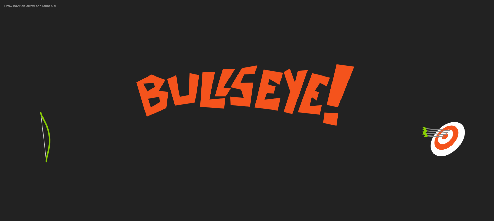

# Bullseye Game 🎯

A fun archery game where players shoot arrows at a target! Built using HTML, CSS, and JavaScript.

## Features

- **Visuals:** Smooth animations for shooting arrows.
- **Interactive Target:** Arrows fly toward a dynamic target for a realistic experience.

## How to Play

1. **Start the Game:**
   - Use your mouse to aim at the target.
   - Left-click to shoot arrows.

2. **End the Game:**
   - Refresh the page to reset and play again.

## Basic Overview

Below is a screenshot of the game in action:

  

## File Overview

- **HTML:** Provides the structure of the game, including the target and bow.  
- **CSS:** Adds styling to make the game visually appealing.  
- **JavaScript:** Manages the arrow shooting and animations.

## Future Enhancements

- **Scoring System:** Points for hits and bullseyes.  
- **Start and End Buttons:** Better game controls.  
- **Sound Effects:** Add immersive audio for shooting and hitting targets.  
- **Levels:** Difficulty increases as you progress.  
- **Mobile Support:** Responsive design for touchscreens.
---

Enjoy the game and test your aiming skills! 🎯
